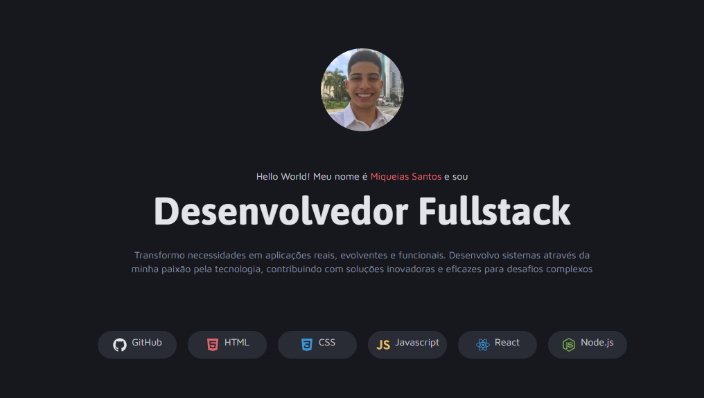

<h1 align="center"> Portfolio Dev</h1>

  Uma Landing Page de portfólio desenvolvida com HTML e CSS puro, focada em estruturação de layout e responsividade.

  <a href="#-tecnologias">Tecnologias</a>&nbsp;&nbsp;&nbsp;|&nbsp;&nbsp;&nbsp;
  <a href="#-projeto">Projeto</a>&nbsp;&nbsp;&nbsp;|&nbsp;&nbsp;&nbsp;
  <a href="#-layout">Layout</a>&nbsp;&nbsp;&nbsp;|&nbsp;&nbsp;&nbsp;
  <a href="#memo-licença">Licença</a>

  

 

  

## 🚀 Tecnologias

Esse projeto foi desenvolvido para praticar os fundamentos da web:

- HTML5
- CSS3 (

## 💻 Projeto

Este foi um dos meus primeiros projetos de portfólio, desenvolvido para consolidar conhecimentos em estilização e estruturação de páginas web.
Apesar de simples, o projeto conta com:
- **Header:** Apresentação pessoal e ícones de skills.
- **Galeria de Projetos:** Cards com efeitos de hover para destacar trabalhos realizados.
- **Serviços:** Seção visualmente distinta usando *background full-width*.
- **Contato:** Lista de redes sociais estilizada.

🔗 [Acesse o projeto online](https://miqueiassantoss.github.io/portfolio-dev/)

## 📝 Licença

Esse projeto está sob a licença MIT.

---

  Feito com 💜 por <a href="https://github.com/miqueiassantoss">Miqueias Santos</a>

